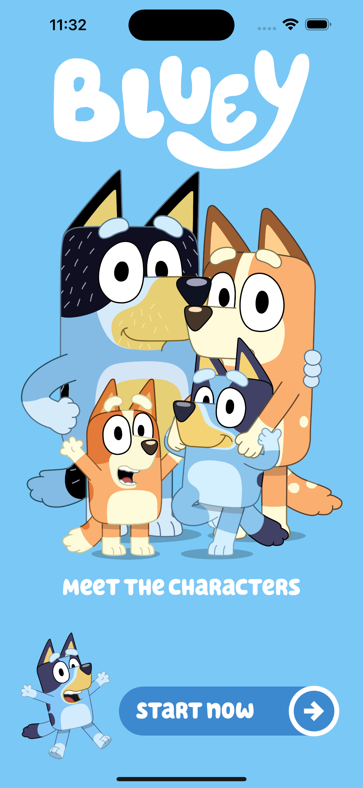
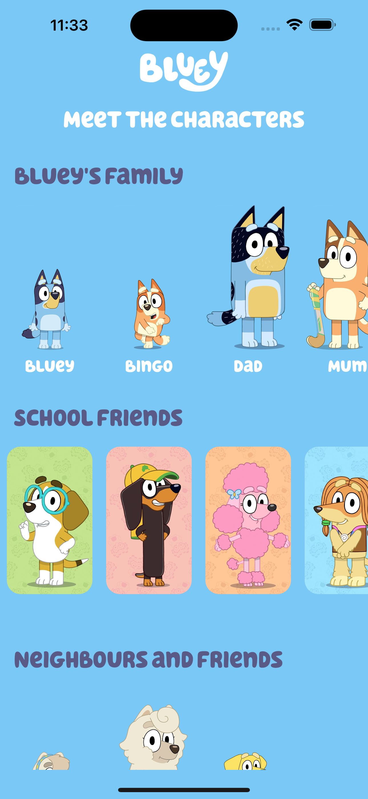
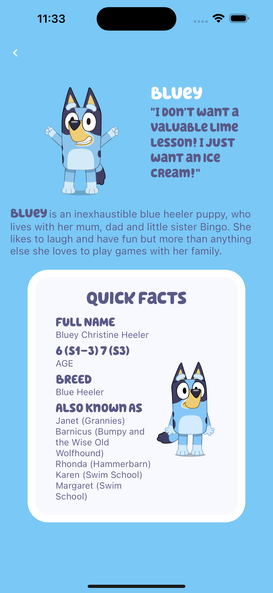
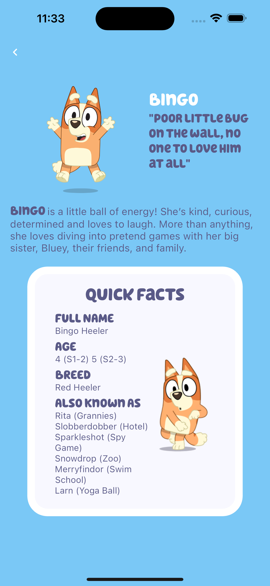

# Bluey

The Bluey App is a Flutter mobile application that provides users with access to the information about your favorites characters.

This application utilises [BloC](https://bloclibrary.dev/#/) and the Firebase API to retrieve the information.

**This application is for educational purposes.**

<p>
     
    
   
   
</p>

## Features

- **Character sections**
- **Character Details** 

## Branches

- **bluey-ui:** Contains only the implementation of the UI. If you wish to practice state management using BloC or an alternative, you may start from this branch.
- **bluey-home-bloc:** Contains only the implementation of the UI and the home state management with Bloc.
- **bluey-character-bloc:** Contains the implementation of the UI, home and character state management with Bloc.

## Installation

Follow these steps to install and run the Champions League Football App:

1. Clone the repository:

   ```shell
   git clone https://github.com/alvaroarmijos/bluey_app
   
2. Open the project in your preferred Flutter development environment (e.g., Android Studio, VS Code).

3. Install the necessary dependencies:

    ```shell
    flutter pub get

4. Build and run the project on your desired device or simulator:

    ```shell
    flutter run

5. Explore the app, check the latest match updates, results, and team statistics.


## Contributing
Contributions are welcome! If you have any ideas, suggestions, or improvements, feel free to open an issue or submit a pull request.